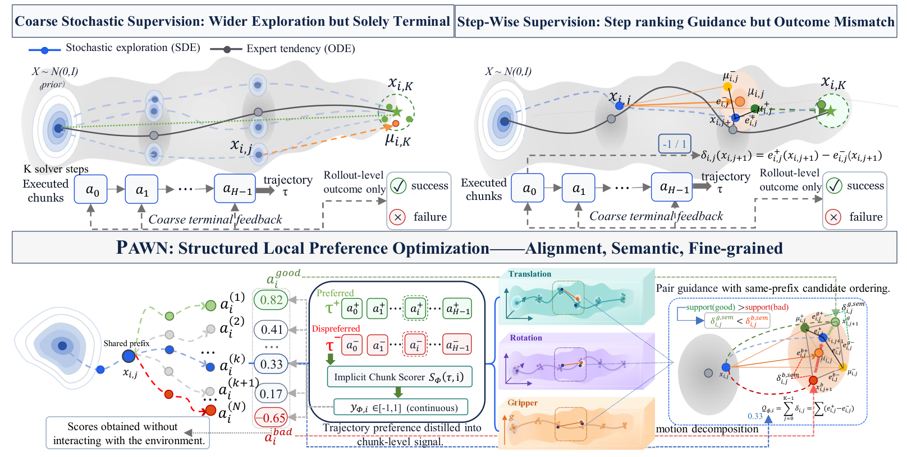

<div align="center">

# PAWN

### Preference-Aware Semantic NFT for Online Reinforcement Learning of Flow-based VLAs

**Haomin Zuo · Wenzhan Li · Ruimao Zhang · Yulan Guo**

[](LICENSE)
[](https://github.com/RLinf/openpi)
[](https://github.com/RLinf/RLinf)

</div>



PAWN adapts flow-based vision-language-action policies through structured local preference optimization, without a value critic or explicit action likelihoods. It combines **implicit chunk credit**, **motion-mode-aware Block-NFT**, and **conditional pair guidance**. Hard-failure-centric scorer training supplies informative preferences as online adaptation progresses.

## Installation

Use Linux with NVIDIA GPUs and the RLinf OpenPI environment:

```bash
git clone https://github.com/ZzzzzZhhmm/pawn.git
cd pawn
docker run -it --rm --gpus all --shm-size 20g --network host \
  -v "$PWD:/workspace/pawn" -w /workspace/pawn \
  rlinf/rlinf:agentic-rlinf0.1-maniskill_libero
source switch_env openpi
bash requirements/install.sh
```

For a non-container setup, prepare the [RLinf OpenPI dependencies](https://github.com/RLinf/RLinf) first.

## Weights And Assets

Set `PAWN_MODEL_PATH` to the matching OpenPI PyTorch SFT checkpoint, including its action normalization statistics. Actor and rollout workers share this path.

```bash
export PAWN_MODEL_PATH="$PWD/checkpoints/<matching-sft-checkpoint>"
export LIBERO_REPO_PATH="$PWD/third_party/LIBERO"  # your installed LIBERO checkout
```

For ManiSkill, prepare the custom task assets and simulator assets:

```bash
hf download --repo-type dataset RLinf/maniskill_assets --local-dir assets/maniskill
export MANISKILL_ASSET_DIR="$PWD/assets/maniskill"
export MS_ASSET_DIR="$PWD/assets/maniskill-sim"
python -m mani_skill.utils.download_asset bridge_v2_real2sim -y
python -m mani_skill.utils.download_asset widowx250s -y
```

## Training

Configurations are in [examples/embodiment/config](examples/embodiment/config). Append `_pi05` to a configuration name to use $\pi_{0.5}$; the default is $\pi_0$.

| Benchmark | Configuration |
| :-- | :-- |
| LIBERO Spatial | `libero_spatial_nft_actor_openpi` |
| LIBERO Object | `libero_object_nft_actor_openpi` |
| LIBERO Goal | `libero_goal_nft_actor_openpi` |
| LIBERO Long | `libero_10_nft_actor_openpi` |
| ManiSkill | `maniskill_nft_actor_openpi` |

```bash
bash examples/embodiment/run_embodiment.sh libero_object_nft_actor_openpi
bash examples/embodiment/run_embodiment.sh maniskill_nft_actor_openpi_pi05
```

Hydra overrides can be passed after the configuration name. Outputs go to `outputs/`; set `PAWN_OUTPUT_DIR` to change the destination. To resume, pass `runner.resume_dir=<run>/<experiment>/checkpoints/global_step_<step>`.

## Evaluation

Use the policy weights saved under `actor/model_state_dict/full_weights.pt`:

```bash
export PAWN_CHECKPOINT="outputs/<run>/<experiment>/checkpoints/global_step_200"
bash examples/embodiment/run_eval.sh libero_object_nft_actor_openpi \
  "runner.ckpt_path=$PAWN_CHECKPOINT/actor/model_state_dict/full_weights.pt"

CKPT_PATH="$PAWN_CHECKPOINT/actor/model_state_dict/full_weights.pt" \
  bash examples/embodiment/eval_mani_ood.sh maniskill_nft_actor_openpi_pi05
```

Evaluation writes `eval_metrics.json` and videos under each evaluation output directory.

## Citation

```bibtex
@inproceedings{zuo2026pawn,
  title     = {PAWN: Preference-Aware Semantic NFT for Online Reinforcement Learning of Flow-based VLAs},
  author    = {Zuo, Haomin and Li, Wenzhan and Zhang, Ruimao and Guo, Yulan},
  booktitle = {Conference on Robot Learning},
  year      = {2026}
}
```

## Acknowledgements

Built on [RLinf](https://github.com/RLinf/RLinf), [$\pi$-StepNFT](https://github.com/wangst0181/pi-StepNFT), and [OpenPI](https://github.com/Physical-Intelligence/openpi). Upstream copyright notices and the Apache 2.0 license are retained.
